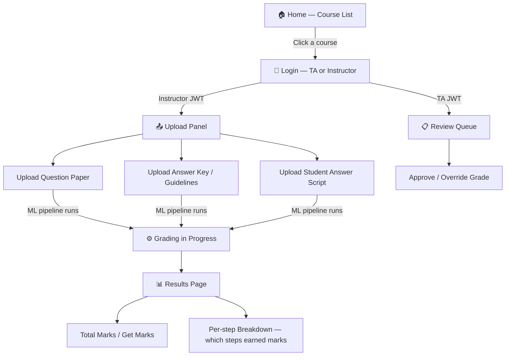

# GradeOps Frontend Guide

## Overview

Your GradeOps backend is **well-designed and mostly ready** to power your frontend — but there are **a few gaps** to fill first. This guide maps your UI vision to the existing backend API endpoints, highlights what's missing, and proposes an execution plan.

---

## 🗺️ Your Frontend Flow (Mapped to Backend)



---

## ✅ What the Backend Already Supports

| Frontend Screen | Backend Endpoint | Notes |
|---|---|---|
| Login (TA / Instructor) | `POST /auth/login` | Returns JWT access + refresh token |
| List Courses/Exams | `GET /exams` | Paginated; role-based filtering already built |
| Upload exam paper | `POST /exams` | Supports PDF/PNG/JPEG up to 20 MB |
| View total marks | `GET /grades?exam_id=...` | Per-student grade with `score`, `max_score`, `percentage` |
| Per-step breakdown | `GET /grades/{grade_id}` | `per_question_breakdown` JSONB field holds step-level marks |
| TA Review Queue | `GET /reviews` | Shows all flagged grades for TA |
| Approve a grade | `PATCH /reviews/{id}/approve` | Teacher accepts ML result |
| Override a grade | `PATCH /reviews/{id}/override` | Teacher corrects the score |
| Refresh session | `POST /auth/refresh` | Auto-refresh access token |

---

## ⚠️ Gaps Between Your UI Vision and the Current Backend

### 1. 🔴 Routers Are Commented Out in `main.py`
The routers exist in `app/routers/` but are **not mounted**. You must uncomment these in `main.py`:
```python
# Lines 148–153 in main.py — uncomment ALL of these:
app.include_router(auth.router,      prefix="/auth",      tags=["Auth"])
app.include_router(users.router,     prefix="/users",     tags=["Users"])
app.include_router(exams.router,     prefix="/exams",     tags=["Exams"])
app.include_router(questions.router, prefix="/questions", tags=["Questions"])
app.include_router(grades.router,    prefix="/grades",    tags=["AI Grades"])
app.include_router(reviews.router,   prefix="/reviews",   tags=["TA Reviews"])
```
Also uncomment the import at line 25:
```python
from app.routers import auth, exams, questions, grades, reviews, users
```

---

### 2. 🟡 "Courses" concept doesn't exist — you have "Exams"
Your UI shows a **course list** first. The backend has `Exams` (individual papers), not courses. You have two options:
- **Option A (Quick):** Treat each unique `subject` field in an Exam as a "course". Group `GET /exams` results by `subject` on the frontend.
- **Option B (Proper):** Add a `Course` model with a FK relationship: `Course → Exams`. This requires a new model + router.

**Recommendation:** Start with Option A to move fast, migrate to Option B later.

---

### 3. 🟡 No separate upload for "Answer Key / Guidelines"
`POST /exams` only uploads one file (the question paper). Your UI needs **3 separate uploads**:
1. Question paper
2. Answer key / rubric guidelines
3. Student answer script

The backend needs new fields on the `Exam` model (or separate endpoints):
```python
# Add to Exam model:
answer_key_path: str | None        # rubric/guidelines file
student_script_path: str | None    # student's handwritten answer
```
Or create a separate `StudentSubmission` model.

---

### 4. 🟡 "Courses → Login" flow needs role clarification
Your backend uses roles: `teacher`, `admin`, `student`. Your UI uses `Instructor` and `TA`.

**Mapping:**
| Your UI Role | Backend Role |
|---|---|
| Instructor | `teacher` |
| TA | `teacher` (or add a new `ta` role) |

Currently `require_roles("teacher", "admin")` gates upload/review endpoints. If TA should have restricted access vs full Instructor access, add a `ta` role to the user model.

---

### 5. 🟢 `per_question_breakdown` already has step-level marks
The grade model stores:
```json
[
  { "question_id": "q1", "score": 4, "max_score": 5, "feedback": "Good derivation" },
  { "question_id": "q2", "score": 0, "max_score": 5, "feedback": "Missing key step" }
]
```
This is exactly what your **"marked steps"** UI needs. Just read `GET /grades/{grade_id}` and render `per_question_breakdown` as a list.

---

## 🏗️ Recommended Tech Stack for Frontend

Since the backend is pure FastAPI (REST JSON + JWT), any frontend framework works. Given the empty `frontend/` directory:

| Option | Recommended? | Why |
|---|---|---|
| **React + Vite** | ✅ Best | Fast, modern, great DX |
| Next.js | ✅ Good | If you want SSR |
| Plain HTML + JS | ⚠️ Okay | Quick to start, hard to maintain |
| Vue / Svelte | ✅ Fine | If you prefer these |

**Suggested: React + Vite** (already whitelisted in the backend CORS: `http://localhost:5173`)

---

## 🚀 Execution Plan

### Phase 1 — Fix the Backend (30 min)
- [ ] Uncomment router imports + `include_router` calls in `main.py`
- [ ] Verify the backend starts: `uvicorn app.main:app --reload` from `backend/`
- [ ] Test `/docs` Swagger UI at `http://localhost:8000/docs`
- [ ] Add `answer_key_path` and `student_script_path` fields to `Exam` model

### Phase 2 — Scaffold the Frontend (1 hr)
- [ ] `cd GradeOps/frontend && npx create-vite@latest ./ -- --template react`
- [ ] Install axios: `npm install axios`
- [ ] Create an API client pointing to `http://localhost:8000`

### Phase 3 — Build the 5 Screens
| Screen | Key API calls |
|---|---|
| Course/Exam List | `GET /exams` grouped by subject |
| Login Modal | `POST /auth/login` → store JWT in localStorage |
| Upload Dashboard (Instructor) | `POST /exams` with 3 file form fields |
| Results Page | `GET /grades?exam_id=...` + render breakdown |
| TA Review Queue | `GET /reviews` + `PATCH /reviews/{id}/approve` or `/override` |

### Phase 4 — Connect ML Pipeline
- [ ] ML pipeline calls `POST /grades` with `X-Api-Key` header
- [ ] After upload, poll `GET /exams/{id}` for status change: `pending → graded`
- [ ] Show spinner while status is `pending`

---

## 🔑 Authentication Flow in Frontend

```js
// 1. Login
const { access_token, refresh_token } = await axios.post('/auth/login', { email, password });
localStorage.setItem('token', access_token);

// 2. Every request
axios.defaults.headers.common['Authorization'] = `Bearer ${access_token}`;

// 3. Token expired? Auto-refresh
const { access_token: newToken } = await axios.post('/auth/refresh', { refresh_token });
localStorage.setItem('token', newToken);
```

---

## Summary: Is the Backend Enough?

| Feature | Status |
|---|---|
| Auth (login, JWT, roles) | ✅ Ready (just uncomment routers) |
| List exams / courses | ✅ Ready |
| Upload question paper | ✅ Ready |
| Upload answer key + student script | ⚠️ Needs new fields on Exam model |
| View total marks + percentage | ✅ Ready |
| View step-by-step breakdown | ✅ Ready (per_question_breakdown) |
| TA review approve/override | ✅ Ready |
| ML pipeline grading trigger | ⚠️ ML pipeline itself is not built yet (ml_pipeline/ is empty) |

> [!IMPORTANT]
> The biggest missing piece is the **ML pipeline** in `ml_pipeline/` — it is currently empty. Without it, uploads won't automatically produce grades. You'll either need to build it or mock it with a test script that calls `POST /grades` directly.

> [!TIP]
> Start by uncommenting the routers in `main.py`, verifying the backend runs, then scaffold the Vite+React frontend. You can mock the grading result initially and wire up the real ML pipeline later.
